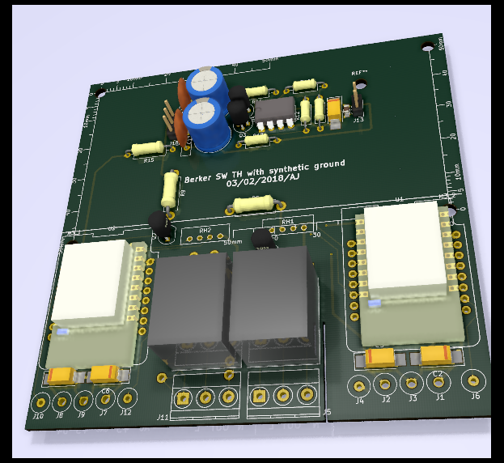
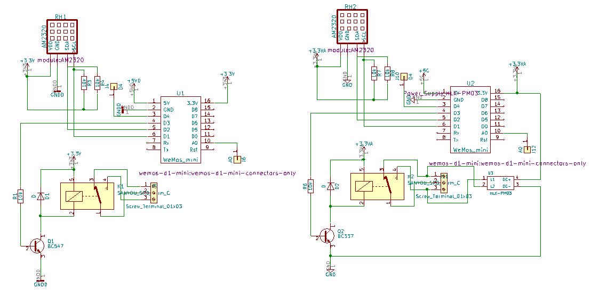
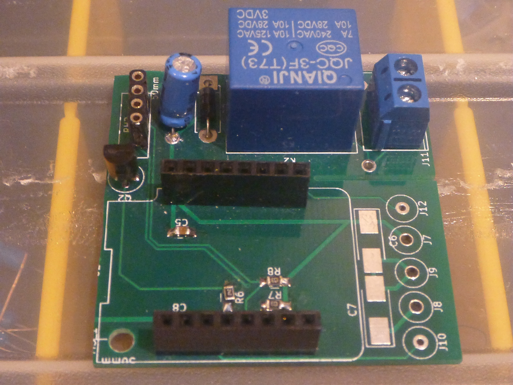

Green board

# Overview
## Status - Functional with issues

## Wemos D1 mini - section 1

Section 1 is a sensor board for a Wemos D1 mini, that is intended for installing in a Berker wall outlet (euro style). 
Section 1 has an AM2320, a relay and a power supply. Besides this it has breakout of pins A0 and D4.

## Issues

There is one issue with section 1 that should be addressed in the next revision. The board size is 2mm too big in X and Y, to fit into a Berker wall mount. 

## Wemos D1 mini - section 2

Section 2 is similar to section 1 except it has room on the backside for a PM03 AC-DC converter. 
It is intended as a board for installing in a Berker outlet. 
Section 2 has an AM2320, a relay and a power supply. Besides this it has breakout of pins A0 and D4.

## Issues

There are two flaws with section 2 that should be addressed in the next revision: 
### Board dimensions
The corners of the board inhibits it from fitting into a Berker wall mount. 
Either the board should be 47x47mm (3mm shorter in X and Y) or the corners should be milled away with a 8mm diameter drill
### Footprint of AC-DC converter
The PM03 footprint has been flipped so it does not fit in the PCB.

## Virtual Ground Section

# 3D board view

# Shecmatic

# Section 2 

